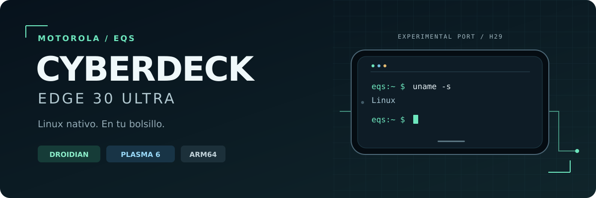

<p align="center">
  <strong>English</strong> ·
  <a href="README.es.md">Español</a> ·
  <a href="README.pt-BR.md">Português (Brasil)</a>
</p>

<p align="center">
  
</p>

# Cyberdeck Edge 30 Ultra

**From phone to pocket workstation.** A **Droidian + Plasma Mobile 6** port
for the Motorola Edge 30 Ultra (`eqs`): native Linux, a terminal, desktop
applications and development tools on a pocket-sized device.

<p align="center">
  <a href="#status">Status</a> ·
  <a href="#architecture">Architecture</a> ·
  <a href="#build-and-install">Build and install</a> ·
  <a href="#documentation">Documentation</a> ·
  <a href="#contributing">Contributing</a>
</p>

> [!IMPORTANT]
> **The phone already boots and runs Plasma. The port is still experimental.**
> Validation applies to one **256 GB XT2241-2 RETAR** unit.
> This is not an official ROM or a universal, ready-to-install image:
> some features remain unfinished, builds require local binary inputs,
> and the clean installation still needs physical validation.

## Why it exists

- **Terminal and networking:** SSH, tmux, Git, editing and system diagnostics.
- **Pocket development:** a customized shell, editors, CLI tools
  and ARM64 scientific environments.
- **Touch-friendly desktop:** Plasma Mobile with lockable landscape rotation,
  maximized windows and manual control of the on-screen keyboard.

The built-in screen is the only display. USB-C is reserved for peripherals,
data and power; external displays and Motorola Ready For are out of scope.

## Status

**Documented baseline: September 11, 2026.**
Kernel **H29**, Plasma Mobile **6.3.3 +eqs5**, Wayfire/HWC, libhybris, Maliit and
XWayland. Android 14 firmware base: `U1SQS34.52-21-1-16`. The bootloader stays unlocked.

**September 15 — Plasma 6.7.5 desktop running:** adapted Mobile/Workspace,
Qt 6.10.2 GLES and Frameworks 6.28 passed native package checks, retaining H29
and Wayfire/HWC. After the QScreen fix, a subsequent boot and an unlocked
screen capture confirm the landscape desktop, 200% scale and Spanish date.
Auto Hide Panels is enabled: Eduardo confirmed that the bars hide, reveal on
edge swipes, and Home/Recents work. The full usability matrix remains pending;
the image recipe remains **6.3.3 +eqs5**.
[Upgrade evidence and remaining work](port/plasma-mobile-wf/UPGRADE-6.7.md).

| Area | Evidence and limitations |
| :--- | :--- |
| 🟢 Native boot | Droidian, systemd as PID 1 and the UFS/LVM root verified; recoverable H29 boot bundle. |
| 🟢 Plasma and navigation | Home, Recents, Close and gestures adapted to Wayfire; improved usability confirmed. |
| 🟢 Desktop | 200% scaling, four workspaces, generic maximization and a 1000 ms resize timeout for Ghostty and other slow clients. |
| 🟢 Rotation and lockscreen | Preserves 90°/270° landscape; lockscreen wallpaper follows the desktop. Dates and lockscreen labels localized with `+eqs5`. |
| 🟢 Wi-Fi and SSH | Native access used to install and verify the system. This is not an eight-hour battery-life test. |
| 🟢 Storage | `/` and `/home` share a **224.52 GiB** ext4 filesystem; growth and reboot verified without changing GPT/PV/LV. |
| 🟡 Replacement touchscreen | 2× libinput calibration confirmed **only for this unit's replacement panel**; do not apply it to every `eqs`. |
| 🟡 On-screen keyboard | The **Teclado táctil** toggle and `osk on/off` work; control is manual, not automatic USB keyboard detection. |
| 🟡 Audio and cameras | Stock modules/policy corrected; main and front cameras produce previews. Landscape fix installed; visual confirmation, saved photos, auxiliary cameras and maximum quality remain pending. |
| 🟡 Bluetooth | Xbox controller over Bluetooth confirmed working by the owner after the H29 `joydev` fix. Headphone audio/microphone and joydev reboot persistence remain unverified. [Details](docs/BLUETOOTH.md). |
| 🟡 USB-C hub | Hub and RF receiver work with PD. **A fresh connection without external power still fails**; a swap allowed an existing connection to keep running. |
| 🟡 Application GPU acceleration | Wayfire uses the Adreno 730. The regular Ghostty/Zed setups use software rendering; the isolated accelerated Zed test is not integrated yet. |
| 🔴 Encrypted daily-driver image | Pending. The preview has no LUKS and must not be treated as a hardened work device. |

🟢 Verified on the test unit · 🟡 Partial or conditional · 🔴 Pending

## Architecture

**Droidian boots natively; this is not a chroot or a remote desktop.**
Graphics integration reuses the device's Android services and drivers:

```text
               Plasma Mobile 6
                      │
                 Wayfire / HWC
                      │
       Halium · libhybris · Android in LXC
                      │
       eqs H29 kernel + Motorola firmware
                      │
         Snapdragon 8+ Gen 1 · Adreno 730
```

KWin does not act as the compositor, and Phosh is not part of the target experience.
Waydroid is an **optional addition for Android applications**, separate
from the container Halium needs for hardware integration.

## Build and install

### First: source code, the phone and the image are different things

| Artifact | Status |
| :--- | :--- |
| Development phone | H29 + Plasma `+eqs5`, installed fixes and documented native evidence. |
| This repository's build recipe | Pins the `+eqs5` package; requires **22 local inputs** with SHA-256 hashes. |
| ZIP built on September 10 | 1.76 GiB preview with `+eqs4`; inspected on the host, **not validated as a clean installation on the phone**. |
| New ZIP with `+eqs5` | **Not built yet.** This repository has no public binary download. |

The image is built from a **clean base**, never by exporting the live root,
`/home`, accounts or credentials from the phone. The September 1 ZIP is
historical and **does not represent the current port**.

```sh
git clone https://github.com/eduardojvieira/cyberdeck-edge-30.git
cd cyberdeck-edge-30

# Only after preparing Docker, ARM64 binfmt and the local inputs.
# The output path must not exist. This command does not flash the phone.
port/build-eqs-rootfs.sh --consolidated "$PWD/.work/eqs-image-new" stock
```

- **Original screen:** use the `stock` profile. **The development unit's calibrated
  replacement:** `replacement`. The Goodix name cannot distinguish them.
- The current geometry targets the **256 GB** unit, not a smaller layout.
- The builder preserves the **tested H29 binary**; rebuilding another kernel
  with the same `uname -r` does not demonstrate equivalence.
- Historical builders/flashers do not reproduce the current system. Do not use
  `--historical` as an installation shortcut.

**Read before starting:** [inputs and build process](port/image/README.md) ·
[release, hashes and evidence](docs/RELEASE-20260910.md) ·
[installation and rescue](port/image/INSTALL.md).

> [!WARNING]
> A clean installation **destroys `userdata`**. Prepare a tested recovery path,
> verify the variant and firmware, and use a direct cable: **never flash through
> a USB-C hub or relock the bootloader with a modified image**.
> Slot B is not a backup. Do not diagnose a graphics failure by wiping data.
> The preview uses a template PIN: change it before connecting to any network.

## Software installed on the phone

| Category | Tools and documentation |
|---|---|
| Terminal | Fish/Starship, fzf, zoxide, Neovim, Ghostty 1.3.1 and isolated Hollywood/tmux. [Shell](port/shell/README.md). |
| Development | ARM64 Homebrew, mise, uv, GitHub CLI, Brew Browser as the only Brew GUI; GitUI, Lazygit, Yazi, ncdu, Mosh and Restic. |
| Editors/agents | VS Code, Antigravity/CLI, Zed, Herdr, Codex and Pi with portable configuration; credential stores not copied, remote logins pending. |
| Science | Octave 11.3, wxMaxima 26.08/Maxima 5.50, scientific Python, SageMath, Spyder, JupyterLab and ARM64 Scilab **2026.1**. APT Scilab 2024 was removed and 2026 revalidated. [Science](port/shell/SCIENCE.md). |
| Office | ARM64 ONLYOFFICE 9.4 with its official repository scoped to that app. [Office](port/shell/OFFICE.md). |
| Android (September 11–12) | Waydroid + Android 13 GAPPS/Google Play installed without flashing; Android startup, networking and KDE launch checked. Play Store shortcut made visible in Plasma; user login pending. Experimental integration, not included in the clean ZIP. [Usage, adjustments and limitations](port/waydroid/README.md). |

These tools are on the phone; the base image does not clone Homebrew,
large environments, accounts or private configurations. Launchers, versions,
tests and maintenance are documented for selective reinstallation.

## Language and performance

<details>
<summary><strong>Argentine Spanish, including the lockscreen</strong></summary>

The system and Plasma formats are configured as **`es_AR.UTF-8`**, with
`LANGUAGE=es_AR:es`. Installed `chromium-l10n`, `firefox-l10n-es-ar`,
`qt6-translations-l10n`, `qttranslations5-l10n`, `hunspell-es` and the
official Spanish language pack for VS Code. Chromium prioritizes `es-AR,es` for websites.
The keyboard layout was not changed, and no distribution upgrade was performed.

Waydroid restarted with effective configuration `es-rAR`; its launchers
were also translated. A fresh SSH login and KDE activation environment were verified.
After a reboot, Plasma already had `es_AR`, but its clocks still formatted
dates in English and the lockscreen contained untranslated text. Installed
[`+eqs5`](port/plasma-mobile-wf/README.md#date-and-lockscreen-language-september-11):
15 native cases pass against the compiled resources, and the Spanish catalog
contains “Contraseña”, “Cargando” and “Descargando”.
**Active after reloading only Plasma with the phone unlocked**: visually verified
“viernes, 11 de septiembre de 2026” and “Descargando” on the lockscreen.
Wayfire and the boot session were unchanged. The status bar passes the native test;
a capture after unlocking is still pending. Scilab now has a
[partial Spanish catalog](port/shell/SCIENCE.md#traducción-española-11-de-septiembre).
These settings are on the **phone**, not in the September 10 ZIP.
Private backups: `/var/lib/eqs-locale-20260911/` and
`~/.cache/eqs-locale-20260911/` on the Edge.
The previous package and the `+eqs5` installation log are in
`/var/lib/eqs-locale-clock-20260911/`.

</details>

<details>
<summary><strong>Geekbench 7 CPU — public result and test conditions</strong></summary>

**Geekbench 7.0.0 Preview for Linux/AArch64**, running natively on
Droidian H29, completed the test and uploaded
[public result 322037](https://browser.geekbench.com/v7/cpu/322037)
with Eduardo's authorization. Exit status `0`; total run time, including upload:
**6 min 47 s**. The phone was charging, using the `walt` governor, with no clock
or thermal-protection changes. This is one run, not an average or a GPU test.

OpenCL enumeration through libhybris caused even `--help` to fail; it was bypassed
only for this process by pointing `OCL_ICD_VENDORS` to an empty directory.
The system ICD was not changed. Private logs are in
`~/.cache/eqs-geekbench7-20260911/` on the Edge; **do not publish the claim link**.
The public viewer returned HTTP 403 to the reading tools, so
unverified scores were not transcribed. Do not compare with Geekbench 6.

</details>

## Updates without reflashing

The phone and consolidated recipe use `Acquire::Droidian::Version "current";`.
`101.20251130` identifies the build base, not a permanent requirement.

```sh
sudo apt update
apt-mark showhold
sudo apt -s upgrade
```

Review signatures, downgrades and Qt/Plasma/Halium changes before applying them.
Do not mix in Sid, blindly remove holds or automate `full-upgrade`. PackageKit
already replaced patched Plasma with upstream due to priority 1002: the hold matters.
The image protects Plasma/kernel and disables boot writes from triggers
with `FLASH_BOOTIMAGE=no`; this does not guarantee every upgrade is safe.
The camera launcher falls back to system Qt if its version changes and requires a rebuild.
[Maintenance details](docs/HISTORY-20260910.md#mantenimiento-apt-de-h29).

## Documentation

This English README is the reference version. Linked technical guides retain
their original language; the README translations cover the project overview.

| If you want to… | Start with… |
| :--- | :--- |
| Understand how native boot was achieved | [Bring-up plan](docs/BRINGUP-PLAN.md) and [port history](docs/HISTORY-20260910.md) |
| Build, inspect or recover an image | [Builder](port/image/README.md), [installation](port/image/INSTALL.md), [recovery](docs/RECOVERY.md) and [September 10 release](docs/RELEASE-20260910.md) |
| Work on the desktop | [Plasma/Wayfire patches](port/plasma-mobile-wf/README.md) |
| Investigate a peripheral | [Bluetooth](docs/BLUETOOTH.md), [GPU](docs/GPU.md), [H27–H28 audio/camera](docs/H27-NAVIGATION-AUDIO-CAMERA.md) and [USB/H29](docs/H29-CAMERA-ROTATION-BROWSER.md) |
| Review the camera preview | [Isolated Qt5 override](port/qt5-wayland/README.md) |
| Reinstall tools | [Shell](port/shell/README.md), [science](port/shell/SCIENCE.md), [office](port/shell/OFFICE.md) and [Waydroid](port/waydroid/README.md) |
| Compare sources and devices | [Pinned references](reference/README.md) |

## What's next

- [ ] Build the `+eqs5` ZIP and physically validate the clean installation and recovery.
- [ ] Connect the hub and keyboard without PD from scratch, without manual commands.
- [ ] Confirm landscape previews, saved photos and auxiliary cameras.
- [ ] Integrate GPU acceleration into applications currently using llvmpipe.
- [ ] Complete audio, Bluetooth profiles, suspend, hotplug, thermals and battery-life testing.
- [ ] Produce a LUKS daily-driver image with secure provisioning and tested graphics upgrades.
- [ ] Rebuild every binary input from a fresh clone.

## Contributing

The most useful contributions are small: **a reproducible failure, a sanitized
log, a focused patch and a test that demonstrates what changed**.

When reporting an issue, include the variant, firmware, screen profile,
Plasma/kernel version and last verified step. Always separate host tests from
real phone tests. Do not attach IMEI, serial numbers, keys, tokens, saved networks
or images of your personal system.

<details>
<summary><strong>Quick PC checks — no phone or sudo required</strong></summary>

```sh
python3 port/image/test-image.py
python3 port/kernel/test-eqs-config.py
python3 port/kernel/test-module-inventory.py
python3 port/test-bluetooth-address.py
python3 port/qt5-wayland/test-launcher.py
python3 port/shell/test-osk.py
python3 port/shell/test-hollywood.py
python3 port/shell/test-science.py
git diff --check
```

C++/initramfs regressions need their pinned sources: see their documentation.
**Do not run every test indiscriminately.** `test-wallpaper-sync.py`
and `port/waydroid/check-prepare.py` are native Edge checks;
the latter prepares devices and requires authorization to act on the phone.

</details>

Translations into other languages are welcome. Start from `README.md`, add
`README.<language>.md` and update the selector in every version. Preserve
the same warnings, versions, commands and validation status.

### Credits

This work builds on **Droidian, KDE/Plasma Mobile, Wayfire, Halium,
libhybris, LineageOS, AOSP and the `eqs-development` maintainers**. ThinkPhone/Bronco
ports provided references, not binaries interchangeable with `eqs`.
Reference sources and commits: [inventory](reference/README.md).

An independent community port, not officially affiliated with Motorola, Droidian
or KDE. Each component's notices and licenses are preserved; no single license
is declared for the entire tree. Proprietary firmware, build binaries,
logs and backups stay out of Git.

---

<p align="center"><strong>A phone that refuses to be just a phone.</strong></p>
